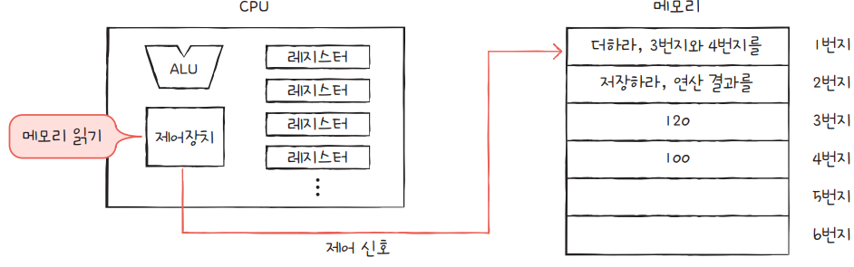
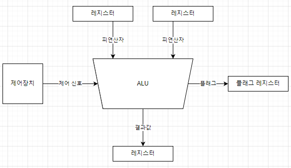

# 4-1. ALU와 제어 장치

CPU는 **명령어를 읽어들이고, 해석하고, 실행하는 장치**이다.

- **ALU** : 계산 담당
- **제어 장치**: 명령어를 읽어들이고 해석
- **레지스터**: 임시 저장 장치

## ✔️ ALU
> 계산하는 부품

### 📥 ALU는 어떤 정보를 받아들일까?
게산을 하기 위해서는 **피연산자와 수행할 연산**이 필요하다.

- **레지스터** ➡️ **피연산자**
- **제어 장치** ➡️ **제어 신호**

### 📤 ALU는 어떤 정보를 내보낼까?

- **연산 결과**: 숫자, 문자, 메모리 주소 등
  - 결괏값을 바로 메모리에 저장하지 않고 일시적으로 **레지스터**에 저장한다. 
  - 메모리에 접근하는 것보다 CPU 내부의 레지스터에 접근하는 것이 훨씬 빠르다.
- **플래그**: 연산 결과에 대한 추가적인 상태 정보
  - **플래그 레지스터**에 저장된다.

| 플래그               | 설명                                                           |
|----------------------|----------------------------------------------------------------|
| **부호 플래그 (SF)**  | 결과 값의 부호를 나타냄. (음수일 경우 설정)                   |
| **제로 플래그 (ZF)**  | 연산 결과가 0일 경우 설정.                                    |
| **캐리 플래그 (CF)**  | 덧셈/뺄셈 연산에서 캐리가 발생했을 때 설정.                     |
| **오버플로우 플래그 (OF)** | 부호 있는 수의 덧셈/뺄셈에서 오버플로우가 발생했을 때 설정.       |
| **인터럽트 플래그 (IF)** | 마스크 가능한 인터럽트를 허용할지 여부를 설정. (1: 허용, 0: 비허용) |
| **슈퍼바이저 플래그 (SF)** | 커널 모드와 사용자 모드를 구분하는 플래그. (0: 사용자 모드, 1: 커널 모드) |

## ✔️ 제어 장치
> 제어 신호를 내보내고 명령어를 해석하는 부품

**제어 신호란?**
> 컴퓨터 부품들을 관리하고 작동시키기 위한 전기 신호

### 📥 제어 장치는 어떤 정보를 받아들일까?

- **클럭 신호**
  - **클럭** : 컴퓨터의 모든 부품이 움직일 수 있게 하는 시간 단위
    - 컴퓨터의 부품들이 클럭마다 작동하는 것은 아니다.
    - 클럭 주기는 다를 수 있다.
- 해석해야 할 **명령어**
  - CPU가 해석해야 할 명령어는 **명령어 레지스터**에 저장된다.
  - 명령어 레지스터로부터 명령어를 받아들여 해석 후 제어 신호를 발생시킨다.
- 플래그 레지스터의 **플래그 값**
- 시스템 버스 중 하나인 제어 버스로 전달된 **제어 신호**
  - CPU 뿐만 아니라 CPU 외부 장치도 제어 신호를 발생시킬 수 있다.
  - 제어 버스를 통해 외부로부터 전달된 제어 신호를 받아들인다.

### 📤 제어 장치는 어떤 정보를 내보낼까?

- **CPU 외부**에 전달하는 제어 신호
  - **메모리**에 전달하는 제어 신호: 메모리에 저장된 값을 읽거나 새로운 값을 쓰고 싶을 때
  - **입출력장치**에 전달하는 제어 신호: 입출력장치의 값을 읽거나 새로운 값을 쓰고 싶을 때
- **CPU 내부**에 전달하는 제어 신호
  - **ALU**에 전달하는 제어 신호: 수행할 연산 지시
  - **레지스터**에 전달하는 제어 신호: 레지스터 간에 데이터를 이동시키거나 저장된 명령어 해석