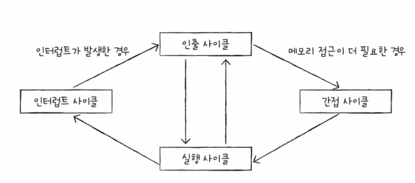

# 4-3. 명령어 사이클와 인터럽트

CPU가 하나의 명령어를 처리하는 과정은 정해진 흐름(명령어 사이클)이 있고, 흐름이 끊어지는 상황(인터럽트)가 발생하기도 한다.

## ✔️ 명령어 사이클
> 프로그램을 이루는 명령어들이 반복되며 실행되는 일정한 주기

- **인출 사이클**: 명령어를 메모리 → CPU로 가져오는 단계
- **간접 사이클**: 어떤 명령어를 실행하기 위해 메모리 접근을 한 번 더 해야하는 단계
- **실행 사이클**: CPU로 가져온 명령어를 실행하는 단계

프로그램 속 명령어들은 인출, 실행 사이클을 반복하며 실행된다.

하지만 어떤 명령어의 경우, 간접 사이클이 필요하기도 하다. 예를 들어, 간접 주소 지정 방식은 유효 주소의 주소를 저장하기에 간접 사이클을 거쳐야한다.

## ✔️ 인터럽트(Interrupt)
> CPU의 정상적인 작업을 방해하는 신호

<u>인터럽트가 발생하는 상황은 중요한 상황이다.</u> 

그렇다면, 어떤 상황에서 인터럽트가 발생하는지 알아보자!

### 동기 인터럽트(=예외)
> **CPU**에 의해 발생하는 인터럽트

CPU가 실행하는 프로그래밍상의 오류와 같은 **예외**에 마주쳤을 때 발생한다.

### 비동기 인터럽트(=하드웨어 인터럽트)
> **입출력장치**에 의해 발생하는 인터럽트

- 완료 알림: 작업을 끝낸 입출력 장치(프린터)가 보내는 인터럽트
- 입력 알림: 입출력장치(키보드, 마우스)가 입력을 받아들였을 때 이를 처리하기 위한 인터럽트

→ 정리하면, 인터럽트의 종류에는 **1)예외**와 **2)하드웨어 인터럽트**가 있다.

### 하드웨어 인터럽트
> 컴퓨터의 입출력장치(키보드, 마우스, 프린터 등)에 의한, **알림**과 같은 인터럽트

- CPU는 입출력 작업 도중 <u>효율적으로 명령어를 처리하고자</u> 하드웨어 인터럽트를 사용한다.
- 하드웨어 인터럽트를 사용하면, 주기적으로 완료 여부를 확인할 필요가 없다.
  - 프린트 완료 여부를 CPU가 계속 확인하는 것은 비효율적이다.
  - 프린트가 완료되었을 때, 완료 인터럽트(알림)을 발생시켜 CPU가 알림을 받도록 하면, 프린터가 작업을 하는 동안 CPU는 다른 작업을 처리할 수 있다.
- 하드웨어 인터럽트의 종류
  - **막을 수 있는 인터럽트**
  - **막을 수 없는 인터럽트**

### 하드웨어 인터럽트 처리 순서

- 입출력 장치가 CPU에 **인터럽트 요청 신호**를 보낸다.
- CPU는 실행 사이클이 끝난 후, 명령어 인출 전 인터럽트 여부를 **항상** 확인한다.
- CPU는 인터럽트 요청을 확인한 후, **인터럽트 플래그**를 통해 현재 인터럽트를 받아들일 수 있는지 확인한다.
- 인터럽트를 받아들일 수 있다면 인터럽트 서비스 루틴이 끝나면 되돌아와서 재개하기 위해, 프로그램 카운터 값 등 현재 프로그램을 재개하기 위해 필요한 모든 정보를 **스택**에 백업한다.
- CPU는 **인터럽트 벡터**를 참조하여 **인터럽트 서비스 루틴**을 실행한다.
- 인터럽트 서비스 루틴 실행이 끝나면 백업해 둔 작업을 복구하여 실행을 재개한다.

#### 용어 정리

- **인터럽트 요청 신호**: 하드웨어가 인터럽트 전에 인터럽트 가능 여부를 질의하는 것
- **인터럽트 플래그**: 하드웨어 인터럽트를 받아들일지, 무시할지 결정하는 비트
  - CPU가 중요한 작업을 처리해야 하거나 어떤 방해도 받지 않아야 할 때 인터럽트 플래그는 불가능으로 설정된다.
  - 우선순위가 높은 인터럽트(정전, 하드웨어 고장 등)는 인터럽트 플래그가 불가능으로 설정되어 있더라도 무시할 수 없다.
- **인터럽트 벡터**: 인터럽트 서비스 루틴의 시작 주소를 포함하는 인터럽트 서비스 루틴의 식별 정보
- **인터럽트 서비스 루틴(=인터럽트 핸들러)**: 인터럽트를 처리하기 위한 프로그램
  - 인터럽트를 처리하기 위한 동작들로 이루어진 프로그램
  - 인터럽트 처리 방법은 입출력장치마다 다르므로, 각기 다른 인터럽트 서비스 루틴을 가진다.
  

## ✔️ 결론

CPU의 명령어 사이클은 **인출, 실행, 간접, 인터럽트 사이클** 4단계로 구성되어 있다.

## 🔍 예외(동기 인터럽트)의 종류

외울 필요는 없고, 가볍게 흝고 넘어가자! 

- **폴트**: 예외를 처리한 직후 발생한 명령어부터 실행을 재개
- **트랩**: 예외를 처리한 직후 예외가 발생한 명령어의 다음 명령어부터 실행을 재개
- **중단**: CPU가 실행 중인 프로그램을 강제로 중단시킬 수밖에 없는 심각한 오류를 발견했을 때 발생하는 예외
- **소프트웨어 인터럽트**: 시스템 호출이 발생했을 때 나타나는 예외