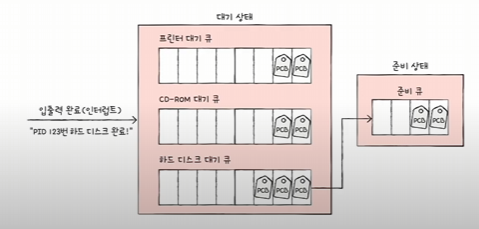
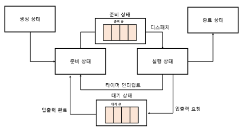

# 11-1. CPU 스케줄링 개요

## ✔️ CPU 스케줄링이란?
> 운영체제가 프로세스들에게 공정하고 합리적으로 CPU 자원을 배분하는 것

CPU 스케줄링은 **컴퓨터 성능과 직결**되는 중요한 문제이다.

## ✔️ 프로세스 우선순위(priority)
> - 상황에 맞게
> - 프로세스의 중요도에 맞게
> - 프로세스가 CPU를 이용할 수 있도록 운영체제는 우선순위를 부여한다. 

어떻게 해야 모든 프로세스들에게 CPU를 **공정하게** 배분할 수 있을까?

-> 모든 프로세스들에게 차례대로 돌아가면서 이용하게 하면 어떨까?

-> 빨리 처리해야 하는 프로세스가 있기 때문에 X

**입출력 집중 프로세스**(입출력 작업이 많은 프로세스)의 우선순위 > **CPU 집중 프로세스**(CPU 작업이 많은 프로세스)의 우선순위

-> 입출력 집중 프로세스는 **대기 상태**에 더 많이 머무름
-> 우선순위를 아예 높여서 빠르게 끝내고 CPU 집중 프로세스를 실행한다

**프로세스의 PCB에 우선순위를 저장한다.**

## ✔️ 스케줄링 큐
> 특정 자원(CPU, 메모리, 입출력장치)을 사용하고 싶은 프로세스들을 줄을 세우는 것

- CPU를 사용할 다음 프로세스를 찾기 위해 운영체제가 모든 프로세스의 PCB를 살펴보는 것은 비효율적이다.

- 자료구조의 큐는 FIFO이지만, 스케줄링 큐는 반드시 FIFO일 필요는 없다.

- 우선순위가 높은 프로세스가 먼저 CPU를 이용한다.

### 준비 큐
> **CPU**를 이용하고 싶은 프로세스들이 서는 줄

준비 상태에 접어든 프로세스들

### 대기 큐
> **입출력장치**를 이용하고 싶은 프로세서들이 서는 줄

대기 상태에 접어든 프로세스들

- 같은 장치를 요구한 프로세스들은 같은 큐에서 대기한다.

- 같은 큐내에서도 우선순위 별로 처리한다.

**운영체제는 스케줄링 큐를 이용해서 프로세스의 상태를 관리하고, 자원을 할당한다.**

## ✔️ 선점형과 비선점형 스케줄링

