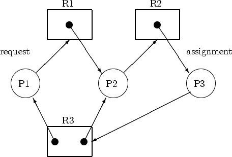

# 13-1. 교착 상태란

## ✔️ 교착 상태
> 두 개 이상의 프로세스가 서로 대기하며 아무것도 진행하지 못하는 상태

즉, 일어나지 않을 사건을 기다리며 무한히 대기하는 현상

**식사하는 철학자 문제** : 교착 상태의 발생 상황, 해결 방법에 대한 가상 시나리오

**뮤테스 락**과 같은 상황에서 교착 상태가 발생할 수 있다.

교착상태를 해결하기 위해서는,
- **교착 상태 발생 상황**에 대해 정확히 파악
- **교착 상태 발생의 근본적인 이유** 파악

## ✔️ 자원 할당 그래프
> 교착 상태를 표현하기 위한 그래프

- **원** : 프로세스
- **사각형** : 자원의 종류
- **사각형 내의 점** : 사용할 수 있는 자원의 개수
- **자원 -> 프로세스** : 프로세스가 자원을 할당받아 사용중
- **프로세스 -> 자원** : 프로세스가 자원을 기다리는 

교착 상태가 발생한 상황은, 자원 할당 그래프가 **원**의 형태를 띈다.

## ✔️ 교착 상태 발생 조건

교착 상태 발생 조건은 4가지가 존재한다.

### 1️⃣ 상호 배제
한 프로세스가 사용하는 자원을 다른 프로세스가 사용할 수 없을 때

### 2️⃣ 점유와 대기
자원을 할당 받은 상태에서 다른 자원을 기다리는 상태

### 3️⃣ 비선점
프로세스가 자원을 비선점 하고 있을 때
(비선점 자원을 이용하는 프로세스의 작업이 끝나야 비로소 이용 가능)

### 4️⃣ 원형 대기
프로세스들이 원의 형태로 자원을 대기하는 것