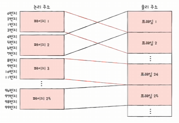
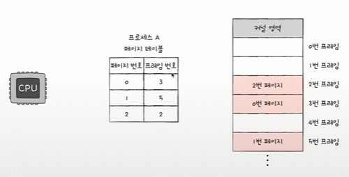
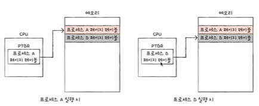

# 14-2. 페이징을 통한 가상 메모리 관리

## ✔️ 가상 메모리
> 실행하고자 하는 프로그램을 **일부만 메모리에 적재**하여 **실제 물리 메모리 크기보다 더 큰 프로세스를 실행**할 수 있게 하는 기술

가상 메모리 방식으로는 **1) 페이징**과 **2) 세그멘테이션**이 있음. 현재 대부분의 운영체제는 페이징 기법을 활용한다.

## ✔️ 페이징
>  모든 프로세스를 **일정 크기**로 자르고, 이를 메모리에 **불연속적으로 할당**함으로써 외부 단편화를 해결하는 가상 메모리 관리 기법

### **외부 단편화**가 발생하는 근본적인 원인?
- 각기 다른 크기의 프로세스가 메모리에 연속적으로 할당되었기 때문이다.
- 만약 모든 프로세스의 크기가 동일하다면 하나의 프로세스가 스왑아웃되어도, 스왑인되는 프로세스 크기와 동일하기 때문에 외부 단편화 발생X

### **페이징이란?**
- 프로세스의 **논리 주소 공간을 페이지(page) 단위**로 자른다.
- 메모리의 **물리 주소 공간을 프레임(frame) 단위**로 자른다.
- 페이지를 프레임에 할당하는 가상 메모리 관리 기법

⚠️ 하지만, 페이징은 **내부 단편화** 문제(하나의 페이지 크기보다 작은 크기로 발생)를 야기할 수 있다. -> 모든 프로세스의 크기가 페이지의 배수가 아니기 때문이다.

#### 페이지
프로세스의 논리 주소 공간

#### 프레임
메모리 물리 주소 공간

### 페이징에서의 스와핑

- 페이징 시스템에서 스왑 아웃은 **페이지 아웃**, 스왑 인은 **페이지 인**이라고 한다.
- 메모리에 적재될 필요가 없는 페이지들은 보조기억장치로 **페이지 아웃**
- 실행에 필요한 페이지들은 메모리로 **페이지 인**

💡 <u>어떤 프로세스를 실행하기 위해서 모든 페이지가 매모리에 적재되어 있을 필요는 없다</u>

💡 달리 말해, 물리 메모리보다 큰 프로세스도 실행될 수 있다 (페이지 아웃과 페이지 인을 통해서!)

## ✔️ 페이지 테이블
> 페이지 번호를 이용해 페이지가 적재된 프레임을 찾을 수 있도록 하는 테이블, **페이지 번호와 프레임 번호를 짝지음**

- 프로세스를 이루는 페이지가 어느 프레임에 적재되어 있는지 CPU가 일일이 알기 어렵다.
- 프로세스가 메모리에 불연속적으로 배치되어 있다면 CPU 입장에서 순차적으로 실행 X
- CPU 입장에서 **다음에 실행할 명령어 위치** 찾기 어려움

-> 이를 해결하기 위한 방식이 **페이지 테이블**
-> 어떤 프로세스의 페이지가 어떤 프레임에 할당 되어 있는지를 기록함! 

<u>프로세스가 물리 주소에 불연속적으로 배치되더라도 논리 주소에는 연속적으로 배치되도록 페이지 테이블을 이용한다.</u>

### PTBR

- 프로세스마다 페이지 테이블이 존재함
- CPU 내의 **페이지 테이블 베이스 레지스터(PTBR)** 는 각 프로세스의 페이지 테이블이 적재된 주소를 가리킨다.
- 페이지 테이블이 메모리에 있다면? 
  - 메모리 접근 시간이 2배로 늘어남
    - 페이지 테이블 참조 1회
    - 페이지 참조 1회

### TLB
> CPU 곁에 페이지 테이블의 캐시 메모리

페이지 테이블의 일부를 가져와 저장한다. 현재 자주 참조하는 페이지 테이블의 일부를 저장한다.

#### TLB 히트
CPU가 접근하려는 논리 주소가 TLB에 있을 때 ➡️ 메모리 접근 1회

#### TLB 미스
CPU가 접근하려는 논리 주소가 TLB에 없을 때 ➡️ 메모리 접근 2회

## ✔️ 페이징에서 주소 변환

### 특정 주소에 접근하고자 한다면 어떤 정보가 필요할까?
- 어떤 페이지/프레임에 접근하고 싶은지
- 접근하려는 주소가 그 페이지 혹은 프레임으로부터 얼마나 떨어져 있는지

### 페이징 시스템에서의 논리 주소
> 페이지 번호 + 변위

페이지 번호 + 변위 ➡️ 프레임 번호 + 변위로 변환된다.

페이지의 크기와 프레임의 크기가 같기 때문의 각각의 변위 크기는 동일하다.

## ✔️ 페이지 테이블 엔트리
페이지 테이블의 각각의 행

- 페이지 번호
- 프레임 번호
- 유효 비트(valid bit) : 해당 페이지에 접근 가능한지 여부 (현재 페이지가 메모리에 적재되어 있는지 아닌지)
  - 유효 비트가 0인 페이지에 접근한다면?
    - **페이지 폴트(page fault)** 인터럽트 발생
- 보호 비트 : 페이지에 접근할 권한을 제한하여 페이지를 보호하는 비트
- 참조 비트 : CPU가 이 페이지에 접근한 적이 있는지 여부
- 수정 비트 : CPU가 이 페이지에 데이터를 쓴 적이 있는지 여부 (수정이 됐는지 아닌지를 알려주는 여부)
  - 스와핑과 관련됨
  - 페이지가 메모리에서 사라질 때, **보조기억장치 쓰기 작업**을 할지 말지 결정하기 위해 존재함
