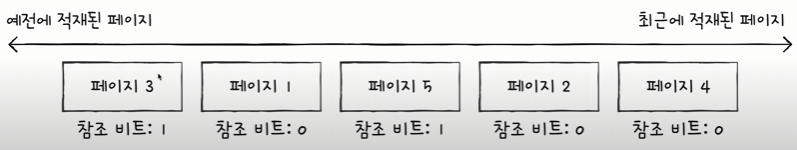
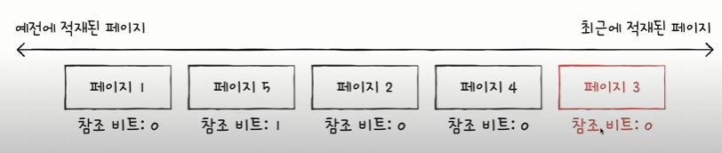

# 14-3. 페이지 교체와 프레임 할당

물리 메모리의 크기는 **한정**되어 있음
- 기존에 적재된 불필요한 페이지를 선별하여 보조 기억장치로 내보내야 함 -> 페이지 교체 알고리즘
- 프로세스들에게 적절한 수의 프레임을 할당해야 함 -> 프레임 할당

## ✔️ 요구 페이징
> 처음부터 모든 페이지를 적재하지 않고 필요한 페이지만을 메모리에 적재하는 기법

요구되는 페이지만 적재하는 기법을 뜻한다.

### 요구 페이징 시스템을 안정적으로 작동하려면?

#### 페이지 교체 알고리즘
- 요구 페이징 기법으로 페이지들을 적재하다보면 언젠가 메모리가 가득 차게 됨
- 당장 실행에 필요한 페이지를 적재하기 위해서는 이전에 적재된 페이지를 보조기억장치로 내보내야 함
- 어떤 페이지를 내보내야 할까?
    - 이를 결정하는 방법이 **페이지 교체 알고리즘**이다.
- 무엇이 좋은 페이지 교체 알고리즘일까?
    - **페이지 폴트가 적은 알고리즘**
    - 페이지 폴트가 발생하면 보조기억장치에 접근해야 해서 성능이 저하된다.
- 페이지 폴트 횟수를 알 수 있는 방법? : **페이지 참조열**
    - 연속된 페이지를 생략한 페이지열
#### 프레임 할당
- 균등 할당
- 비례 할당

## ✔️ 페이지 교체 알고리즘

### FIFO 페이지 교체 알고리즘
> 적재된 페이지 순서대로 교체하는 알고리즘

- 가장 단순한 방식
- 메모리에 가장 먼저 올라온 페이지부터 내쫓는 방식

⚠️ 프로그램 실행 내내 사용될 페이지를 먼저 적재되었다고 내쫓아선 안된다.

- 보완책 : **2차 기회 페이지 교체 알고리즘**
    - 참조 비트 1 : CPU가 한 번 참조한 적이 있는 페이지
    - 참조 비트 0 : CPU가 참조한 적이 없는 페이지

### 최적 페이지 교체 알고리즘
> 앞으로의 사용 빈도가 **가장 낮은 페이지**를 교체하는 알고리즘

- CPU에 의해 참조되는 횟수를 고려
- 메모리에 오래 남아야 할 페이지는 **자주 사용될 페이지**
- 메모리에 없어도 될 페이지는 오랫동안 **사용되지 않을 페이지**

⚠️ 예측이 어렵기에, 실제 구현이 어렵다.

### LRU(Last-Recently-Used) 페이지 교체 알고리즘
> 가장 오랫동안 사용되지 않은 페이지를 교체하는 알고리즘

- 최적 페이지 교체 알고리즘 : 가장 오래 사용되지 **않을** 페이지를 교체
- LRU 페이지 교체 알고리즘 : 가장 오래 사용되지 **않은** 페이지를 교체

## ✔️ 스레싱과 프레임 할당

- 페이지 폴트가 자주 발생하는 이유
    - 나쁜 페이지 교체 알고리즘을 사용해서
    - 프로세스가 사용할 수 있는 프레임 자체가 적어서

### 스레싱
> 프로세스가 실행되는 시간보다 페이징에 더 많은 시간을 소요하여 성능(CPU 이용률)이 저해되는 문제

동시 실행되는 프로세스의 수를 늘린다고 CPU 이용률이 높아지는 것은 아니다.

#### 발생 이유
- 각 프로세스가 필요로 하는 최소한의 프레임 수가 보장되지 X
- 각 프로세스가 필요로 하는 최소한의 프레임 수를 파악하고 프로세스들에게 적절한 프레임을 할당해야 함

### 프레임 할당

#### 균등 할당(equal allocation)
> 모든 프로세스들에게 균등하게 프레임을 할당하는 방식

- 가장 단순한 할당 방식
- 프로세스마다 필요한 프레임 수가 다를텐데, 모두 균등하게 처리하는 것은 비합리적

#### 비례 할당(proportional allocation)
> 프로세스 크기에 비례하여 프레임을 배분하는 방식

⚠️ 어떤 프로세스가 얼마나 많은 프레임 수를 필요로 하는지 알기 위해서는 **실행해봐야 안다.**

균등 할당과 비례 할당은 **프로세스의 크기**만 고려하기 때문에 **정적 할당**이라고 한다.

#### 작업 집합 모델
> CPU가 특정 시간 동안 주로 참조한 페이지 개수만큼만 프레임을 할당해주는 방식

스레싱이 발생하는 이유는 빈번한 페이지 교체가 일어나기 때문임을 고려한 방식이다.

#### 페이지 폴트율 기반 프레임 할당
> 페이지 폴트율에 상한선과 하한선을 정하고, 그 내부 범위안에서만 프레임을 할당하는 방식