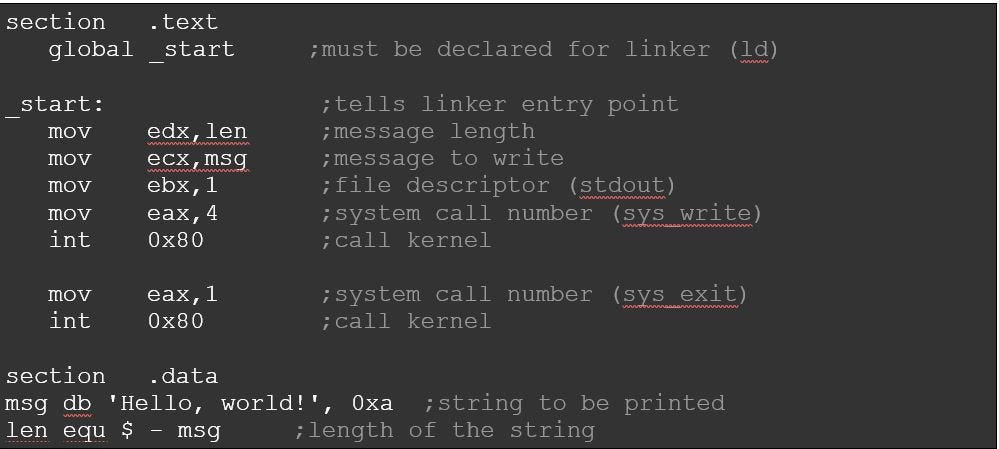

# 3-1. 소스 코드와 명령어

모든 **소스코드**는 컴퓨터 내부에서 **명령어로 변환**된다.

## ✔️ 고급 언어와 저급 언어

- **고급 언어**: 사람을 위한 언어
- **저급 언어**: 컴퓨터가 직접 이해하고 실행할 수 있는 언어
  - **기계어**: 0과 1의 명령어 비트로 이루어진 언어
  - **어셈블리어**: 0과 1로 이루어진 기계어를 읽기 편한 형태로 번역한 저급 언어

**고급 언어(소스 코드)** → **저급 언어(명령어)**로 변환이 일어난다.

## ✔️ 컴파일 언어와 인터프리터 언어

개발자가 작성한 **고급 언어**가 **저급 언어**로 변환되는 방식에는 **컴파일 방식**과 **인터프리터 방식**이 있다.

### 컴파일 언어
> **컴파일 방식**으로 작동하는 프로그래밍 언어

**컴파일러**에 의해 **소스 코드 전체**가 저급 언어로 변환되는 고급 언어이다.
ex) C

소스 코드 내에 오류가 하나라도 있으면 컴파일이 불가능하다.

#### 컴파일
> 컴파일 언어로 작성된 소스 코드 → 저급 언어로 변환되는 과정

#### 컴파일러
> 컴파일을 수행해 주는 도구

#### 목적 코드
> 컴파일러를 통해 저급 언어로 변환된 코드

### 인터프리터 언어
> **인터프리터 방식**으로 작동하는 프로그래밍 언어

**한 줄 한 줄씩** 저급 언어로 해석된다.

N번째 줄에 문법 오류가 있더라도 N-1줄까지는 올바르게 수행된다.

#### 인퍼프리터
> 인터프리터 언어로 작성된 소스 코드 → 저급언어로 변환하여 실행해 주는 도구

## 🔍 목적 파일 vs 실행 파일

### 목적 파일
> 목적 코드로 이루어진 파일

### 실행 파일
> 실행 코드로 이루어진 파일

목적 코드가 실행 파일이 되기 위해서는 **링킹**을 거쳐야 한다.
