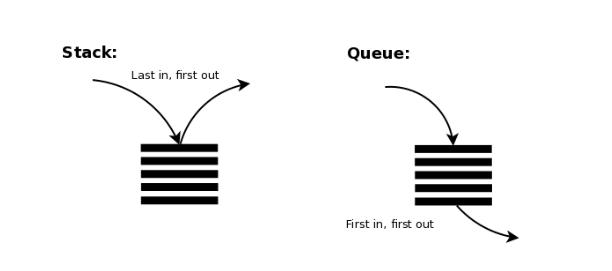

# 3-2. 명렁어의 구조

## ✔️ 연산 코드와 오퍼랜드

명령어는 **연산 코드**와 **오퍼랜드**로 구성되어 있다.

- **연산 코드**: 명령어가 수행할 연산
  - 연산자
- **오퍼랜드**: 연산에 사용할 데이터가 저장된 위치
  - 피연산자

### 연산 코드

연산 코드의 유형은 **4가지**가 있다.
- **데이터 전송**
  - MOVE, STORE, LOAD, PUSH, POP
- **산술/논리 연산**
  - ADD/SUBTRACT/MULTIPLY/DIVIDE, INCREMENT/DECREMENT, AND/OR/NOT:AND/NOT, COMPARE
- **제어 흐름 변경**
  - JUMP, CONDITIONAL JUMP, HALT, CALL, RETURN
- **입출력 제어**
  - READ, WRITE, START IO, TEST IO

CPU마다 연산 코드의 종류와 생김새가 다르다. 

### 오퍼랜드

오퍼랜드 필드에는 연산에 사용할 데이터를 직접 명시하기 보다, **메모리 주소 or 레지스터 이름**이 담긴다.
→ 따라서 오퍼랜드를 **주소 필드**라고도 한다.

- 0-주소 명령어: 오퍼랜드가 하나도 없는 명령어
- 1-주소 명령어: 오퍼랜드가 하나인 명령어
- 2-주소 명령어: 오퍼랜드가 두 개인 명령어
- 3-주소 명령어: 오퍼랜드가 세 개인 명령어

## ✔️ 주소 지정 방식
> 연산에 사용할 데이터 위치를 찾는 방법

**명령어의 길이** 때문에 오퍼랜드 필드에 **메모리 주소나 레지스터의 이름**을 담는 것이다.

<u>연산의 대상인 데이터가 저장된 위치를 **유효 주소**라고 한다.</u>

### 즉시 주소 지정 방식
> 연산에 사용할 데이터를 오퍼랜드 필드에 직접 명시하는 방식

- **장점**
  - 데이터를 메모리나 레지스터로부터 찾는 과정이 없기 때문에 빠르다.
- **단점**
  - 표현할 수 있는 데이터의 크기가 작아진다.

### 직접 주소 지정 방식
> 오퍼랜드 필드에 **유효 주소를 직접적으로 명시**하는 방식

- **장점**
  - 표현할 수 있는 데이터의 크기가 즉시 주소 지정 방식에 비해 크다.
- **단점**
  - 표현할 수 있는 유효 주소에 제한이 생긴다.

### 간접 주소 지정 방식
> **유효 주소의 주소**를 오퍼랜드 필드에 명시하는 방법

- **장점**
  - 직접 주소 지정 방식보다 표현할 수 있는 유효 주소의 범위가 넓다.
- **단점**
  - 두 번의 메모리 접근이 필요하기에 느리다.

### 레지스터 주소 지정 방식
> 연산에 사용할 데이터를 저장한 **레지스터를 오퍼랜드 필드에 직접 명시**하는 방법

- **장점**
  - 메모리에 접근하는 것보다 CPU 내부 레지스터에 접근하기에 더 빠르다.
- **단점**
  - 표현할 수 있는 레지스터 크기에 제한이 생긴다.

### 레지스터 간접 주소 지정 방식
> **유효 주소를 저장한 레지스터**를 오퍼랜드 필드에 명시하는 방법

- **장점**
  - 메모리에 접근하는 횟수가 한 번으로 줄어든다.

| 주소 지정 방식           | 설명                                                                 |
|--------------------------|----------------------------------------------------------------------|
| **즉시 주소 지정 방식**   | 명령어에 포함된 데이터 값을 직접 사용하는 방식.                      |
| **직접 주소 지정 방식**   | 명령어에 명시된 주소에 저장된 데이터를 사용하는 방식.                |
| **간접 주소 지정 방식**   | 명령어에 명시된 주소에 저장된 값이 또 다른 주소를 가리키는 방식.      |
| **레지스터 주소 지정 방식**| 연산에 필요한 데이터가 레지스터에 저장된 데이터를 사용하는 방식.      |
| **레지스터 간접 주소 지정 방식** | 명령어에 명시된 레지스터에 저장된 값이 실제 메모리 주소를 가리키는 방식. |

## ✔️ 스택과 큐

### 스택
> 나중에 들어간 데이터를 가장 먼저 빼내는 자료 구조 (LIFO)

### 큐
> 가장 먼저 저장된 데이터부터 빼내는 자료 구조 (FIFO)

