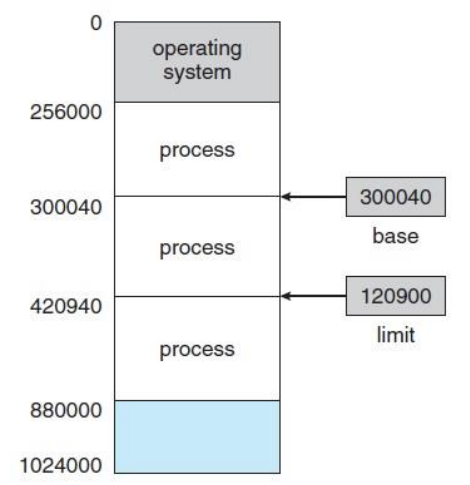

# 메모리의 주소 공간

## ✔️ 물리 주소와 논리 주소

메모리에 저장된 정보는 시시각각 변한다 (계속해서 적재, 삭제됨)

→ 같은 프로그램을 실행할 때마다 적재되는 주소가 달라질 수 있음

### 주소의 종류

#### 🔹 물리 주소
> **메모리**가 사용하는 하드웨어 상의 주소

정보가 실제로 저장된 주소

#### 🔹 논리 주소
> **CPU와 실행 중인 프로그램**이 사용하는 주소

실행 중인 프로그램 각각에 부여된 0번지부터 시작되는 주소

### 주소 간의 변환

- 메모리와 CPU는 서로 다른 주소 체계를 가지고 있음 (물리 주소, 논리 주소)

- **메모리 관리 장치(MMU)가 수행**
- 논리 주소 → 물리 주소 : 논리 주소 + 베이스 레지스터 값

**베이스 레지스터❔**
> 프로그램의 첫 물리 주소를 저장

**논리 주소❔**
> 프로그램의 시작점으로부터 떨어진 거리

## ✔️ 메모리 보호 기법

### 한계 레지스터(limit register)
> 실행 중인 프로그램의 논리 주소의 최대 크기를 저장

- 다른 프로그램의 영역을 침범할 수 있는 명령어 실행 방지

- 실행 프로그램을 다른 프로그램으로부터 보호

- **CPU가 접근하는 논리 주소 ≤ 한계 레지스터 값**

- 만약 CPU가 한계 레지스터보다 높은 논리 주소에 접근 → **인터럽트(트랩)** 발생 → 실행 중단

<mark style="background-color: rgba(255, 255, 0, 0.3);">(베이스 레지스터 값) ≤ (프로그램의 물리 주소) ≤ (베이스 레지스터 값 + 한계 레지스터 값)</mark>

