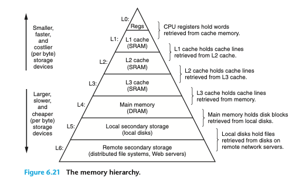

# 캐시 메모리

메모리에 빠르게 접근하기 위해 **캐시 메모리** 도입

## ✔️ 저장 장치 계층 구조(memory hierarchy)
> 각기 다른 용량과 성능의 저장 장치들을 계층화하여 표현한 구조

**CPU에 얼마나 가까운가?** 를 기준으로 함

- CPU랑 가까울수록
  - **속도** 빠름
  - **용량** 작음
  - **가격** 비쌈

## ✔️ 캐시 메모리
> CPU의 연산 속도와 메모리 접근 속도의 차이를 줄이기 위한 저장 장치

- CPU와 메모리 사이에 위치

- 레지스터보다 용량이 큼

- 메모리보다 빠른 SRAM 기반의 저장 장치

- 캐시 메모리의 종류
  - CPU(코어)와 가까운 순서대로 계층 구성
  - **L1 캐시** : 첫 번째로 코어와 가까운 캐시 메모리
    - 코어 내부에 위치
  - **L2 캐시** : 두 번째로 코어와 가까운 캐시 메모리
    - 코어 내부에 위치 
  - **L3 캐시** : 세 번째로 코어와 가까운 캐시 메모리
    - 코어 외부에 위치

## ✔️ 참조 지역성 원리

캐시 메모리는 메모리의 모든 내용을 저장할 수 없다. <u>무엇을 저장해야 할까?</u>

- **메모리**: 실행 중인 대상을 저장

- **캐시 메모리**: CPU가 사용할 법한 대상을 예측하여 저장

**캐시 히트(cache hit)**
> 예측 데이터가 들어맞아 캐시 메모리 내 데이터가 CPU에서 활용될 경우

**캐시 미스(cache miss)**
> 예측이 틀려 메모리에서 필요한 데이터를 직접 가져와야 하는 경우

**캐시 적중률(cache hit ratio)**
> 캐시가 히트되는 비율

`캐시 히트 횟수 / (캐시 히트 횟수 + 캐시 미스 횟수)`

- **캐시 적중률**이 높으면 CPU의 메모리 접근 횟수를 줄일 수 있음. ➡️ **참조 지역성의 원리**

- **시간 지역성**과 **공간 지역성**을 이용하여 CPU가 사용할 법한 데이터를 예측한다.

### 🔹 시간 지역성
> 최근에 접근했던 메모리 공간에 다시 접근하려는 경향

ex) 변수에 특정 값을 저장한 후 여러 번 사용

### 🔹 공간 지역성
> 접근한 메모리 공간 근처를 접근하려는 경향

ex) 워드 프로세서 프로그램을 실행할 때는 워드 프로세서 프로그램 공간 근처에 집중 접근

